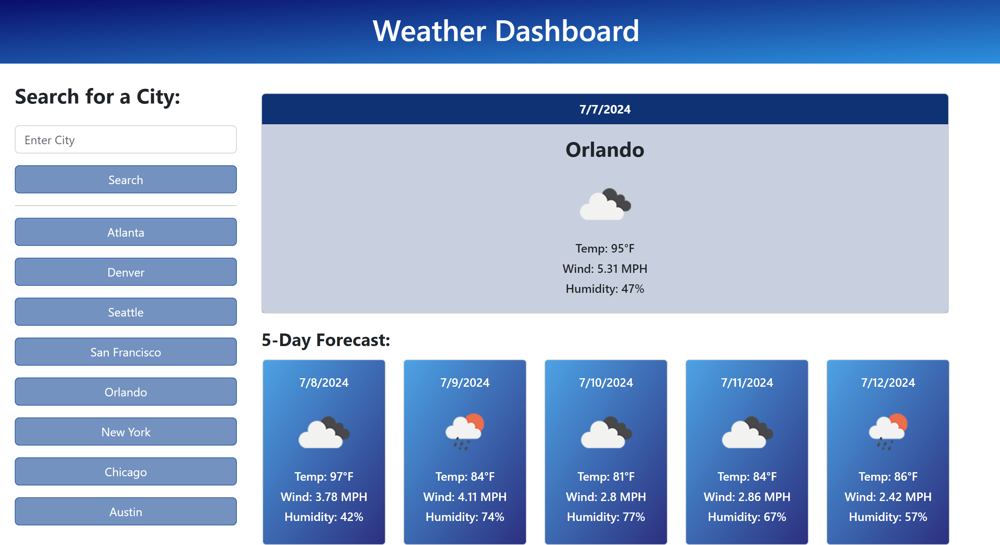

# Weather Dashboard Server-Side APIs

## Description

The motivation behind this project was to create an application that allows the user to view the daily forecast for their city and other cities they choose to search for. By creating this project I was able to gain more experience with server-side APIs in order to retrieve the weather data. That data was then used to dynamically update the HTML and CSS so the weather forecast could be displayed to the user. This also allowed me to use local storage to store persistent data of the searched cities and then display them on the search history.

## Usage

After the user inputs a city into the search field, they are presented with the current weather conditions and a 5-day forecast. Once the weather conditions are displayed, the user is able to see the city name and date along with the temperature, humidity, and wind speed. That city is also added to the search history on the left-hand side. If the user clicks on a city in the search history, they are presented with that the forecast for that city.

